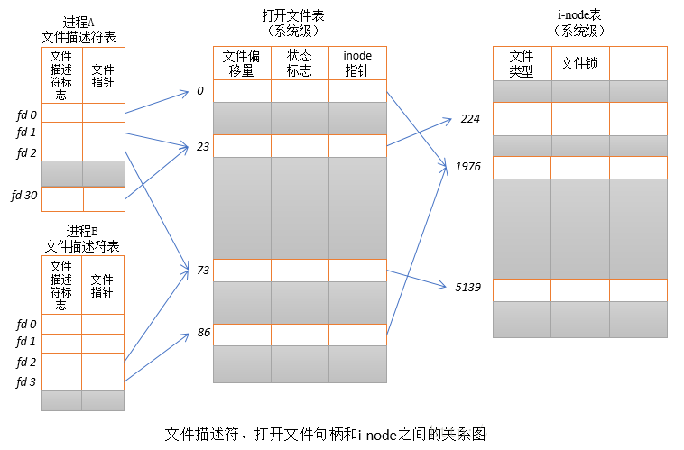
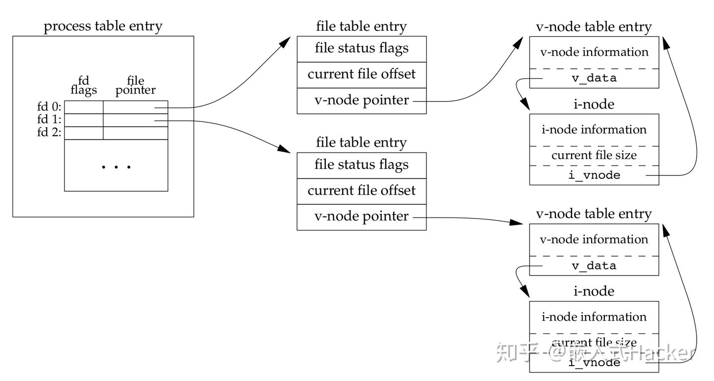
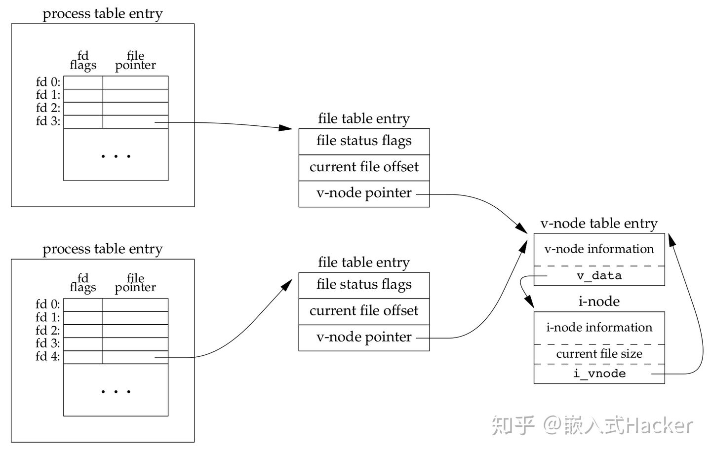
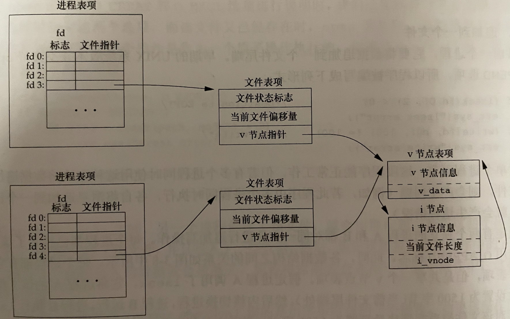
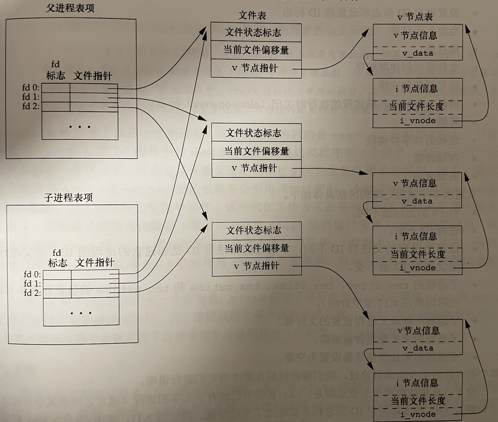

## 内核文件结构
### 模型图
- linux
  
    
- unix

    
### 内核使用3种数据结构表示打开文件。
- 进程表中都有一个记录项，记录项包含该进程打开的所有文件描述符表
    fd   |   fp
    0    |   fp1
    1    |   fp2
    ...
    n    |   fpn
- 内核为所有打开的文件维护一张表：文件表
    - 文件状态标志（r/w/a/ no_block, async等）
    - 当前文件偏移量
    - 指向该文件v节点表项的指针（unix，linux不存在vnode，而是通用的i节点结构，采用了一个与文件系统无关的inode和与文件系统有关的inode）

- 每个打开的文件或者设备都有一个vnode
    - 操作该文件的各种函数
    - 大多文件包扩inode信息，inode包括：文件所有者，文件长度，指向文件所在的硬件盘块指针

## 多进程共享文件模型
- 打开不同文件
  
    
- 打开相同文件
  同一个文件每个进程会单独拥有一个文件表项

    
- fork之后的父进程与子进程之间

  打开同一个文件共享同一个文件表

    

### 多个进程打开同一个文件同步 ？
- 原子操作